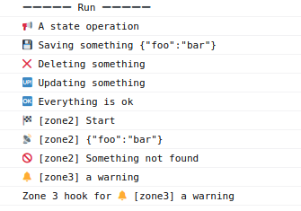

# Emo for Typescript

[](https://www.npmjs.com/package/emosd)

Emoji based semantic debuging

- **Debug the state** and execution flow of your program using familiar idioms
- **Scoped debuging**: activate emo locally
- **Hooks**: callback to execute after logging

## Install

```
npm install emosd
```
or
```
yarn add emosd
```

## Example

   ```javascript
import { Emo } from "emosd";

const emo = new Emo();
const zone2 = new Emo({ zone: "zone2" });
const zone3 = new Emo({ zone: "zone3", hook: (v) => { console.log("Zone 3 hook for", v) } });

async function run() {
emo.section("Run");
emo.state("A state operation");
emo.save("Saving something", { foo: "bar" });
emo.delete("Deleting something");
emo.update("Updating something");
emo.ok("Everything is ok");
zone2.start("Start");
zone2.transmit({ foo: "bar" });
zone2.notFound("Something not found");
zone3.warning("a warning");
   ```

Console output:



See the complete [events list](../events/README.md)

## Scoped debuging

The recommended way is to use local `Emo` instances to be able to enable and disable debug messages for a defined portion of code. Use the `zone` attribute to prefix the messages:

   ```javascript
   const emo = new Emo({ zone: "api" });
   // the messages will be prefixed by [api] :
   emo.notFound(`page not found: ${path}`);
   // output:
   // 🚫 [api] Page not found: /some_page.html
   ```

## Deactivation of output

It is possible to deactivate the printing of the messages for an instance:

   ```javascript
   const emo = new Emo({ activatePrint: false });
   ```

## Deactivation of emojis

It is possible to deactivate the emojis in the messages for an instance:

   ```javascript
   const emo = new Emo({ activateEmojis: false });
   ```

## Hooks

Callbacks to execute after logging. Ex:

   ```javascript
   const emo = new Emo({ 
     hook: (msg) => { console.log(`Hook with message ${msg}`); }
   });
   ```

## Print some json data in console

   ```javascript
   const data = { foo: "bar" };
   emo.json(data);
   // or
   Emo.json(data);
   ```