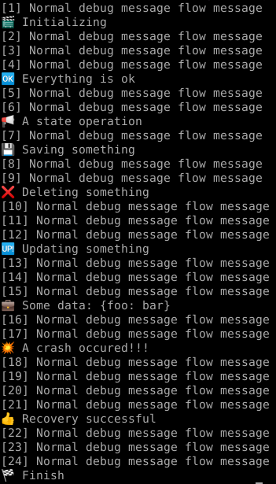

# Emodebug

[](https://pub.dartlang.org/packages/emodebug) [](https://pub.dev/documentation/emodebug/latest/emodebug/EmoDebug-class.html#instance-methods)

Emoji based semantic debuging:

- **Debug the state** and execution flow of your program using familiar idioms
- **Scoped debuging**: activate debug locally
- Easy implementation of custom debug methods: extend the [EmoDebug](https://pub.dev/documentation/emodebug/latest/emodebug/EmoDebug-class.html#instance-methods) class to create your own methods

Looking at the console you get an intuitive global view on the execution flow: 



## Example

   ```dart
   import 'package:emodebug/emodebug.dart';

   const EmoDebug debug = EmoDebug();

   debug.state("A state operation");
   debug.save("Saving something");
   debug.delete("Deleting something");
   debug.update("Updating something");
   debug.ok("Everything is ok");
   // or from an emoji using any object or a string
   debug.emo("📢", obj);
   ```

Available methods: check the  [api documentation](https://pub.dev/documentation/emodebug/latest/emodebug/EmoDebug-class.html)

### Parameters

The methods accept any object as parameter (`dynamic`)

An optional `domain` positional parameter is available for a more precise message:

   ```dart
   final data = {"foo": "bar"};
   debug.data(data, "some data");
   // output:
   // 💼 Some data: {foo: bar}
   ```

## Scoped debuging

The recommended way is to use local `EmoDebug` instances to be able to enable and disable debug messages for a defined portion of code. Use the `zone` attribute to prefix the messages:

   ```dart
   const EmoDebug _ = EmoDebug(zone: "http service");
   // the messages will be prefixed by [http service] :
   _.notFound(path, "page not found");
   // output:
   // 🚫 [http service] Page not found: /some_page.html
   ```

## Deactivation

It is possible to deactivate the printing of the messages for an instance:

   ```dart
   // on top of a file
   const EmoDebug debug = EmoDebug(deactivatePrint: true);
   ```

## Implement custom debug methods

   ```dart
   const CustomEmoDebug debug = CustomEmoDebug();

   class CustomEmoDebug extends EmoDebug {
     const CustomEmoDebug();
   
     void crash(dynamic obj, [String domain]) => emo("💥", obj, domain);
   
     void recovery(dynamic obj, [String domain]) => emo("👍", obj, domain);
   }

   // in the code
   debug.crash("A crash occured!!!");
   debug.recovery("Recovery successful");
   ```


